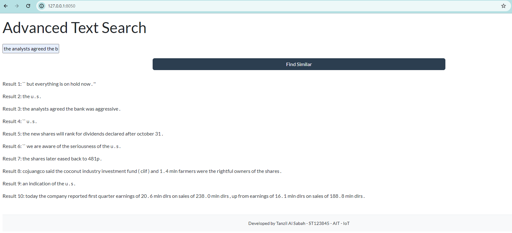

# Search Engine Project

This project focuses on the creation of a search engine, highlighting the practical application of information retrieval in natural language processing. The goal is to develop a web-deployed search engine that returns the top paragraphs with the highest similarity to a given query, such as "Harry Potter." This involves enhancing existing codebases, integrating word embedding techniques, and designing a user-friendly web interface.

## Task 1: Preparation and Training

### Task 1.1: Efficient Estimation of Word Representations in Vector Space

- **Objective**: Explore word embedding techniques and their foundational papers.
- **Papers**:
  - [Efficient Estimation of Word Representations in Vector Space](https://arxiv.org/pdf/1301.3781.pdf)
  - [GloVe: Global Vectors for Word Representation](https://aclanthology.org/D14-1162.pdf)


### Task 1.2: Modification of Word Embedding Models

- **Details**: Modify the Word2Vec (with & without negative sampling) and GloVe models from the lab lecture.
- **Modified Files**:
  - `1.Word2vec-Skipgram.ipynb`
  - `2.Word2vec-Skipgram with Negative Sampling.ipynb`
  - `3.Glove.ipynb`

### Task 1.3: Recognition of Data Sources

- **Dataset Used**: Reuters-21578 Text Categorization Collection via the NLTK library.
- **Purpose**: Serves as a primary resource for supervised learning tasks in NLP.

## Task 2: Model Comparison and Analysis

### Task 2.1: Performance Metrics

#### Training Loss Comparison

| Model | Average Training Loss |
|-------|-----------------------|
| Skip-gram | 8.051740 |
| Skip-gram with Negative Sampling | 1.905731 |
| GloVe | 1.391059 |

#### Training Time Comparison

| Model | Total Training Time |
|-------|---------------------|
| Skip-gram | 30m 36s |
| Skip-gram with Negative Sampling | 29m 22s |
| GloVe | 3m 12s |

### Task 2.2: Word Analogies

- **Objective**: Evaluate models on syntactic and semantic accuracy using the Word Analogies dataset.
- **Results**:

| Model | Window Size | Training Loss | Syntactic Accuracy | Semantic Accuracy |
|-------|-------------|---------------|--------------------|-------------------|
| Skip-gram | 2 | 8.051740 | 0.00% | 0.00% |
| Skip-gram with Negative Sampling | 2 | 1.905731 | 0.00% | 0.00% |
| GloVe (Scratch) | 2 | 1.391059 | 0.00% | 0.00% |
| GloVe (Pre-trained Gensim) | N/A | N/A | 53.40% | 54.97% |

### Task 2.3: Similarity Dataset Analysis

- **Objective**: Assess the correlation between model predictions and provided similarity metrics.
- **Results**:

| Model | Spearman's Rank Correlation |
|-------|-----------------------------|
| Skipgram | 0.124 |
| Skipgram-Neg-Sampling | 0.116 |
| GloVe (Scratch) | -0.091 |
| GloVe (Gensim) | 0.602 |

The Spearman's rank correlation coefficient measures the association strength and direction between two ranked variables. The closer the coefficient is to 1 or -1, the stronger the correlation.

## Task 3: Search Engine - Web Application Development

We have developed a simple web application for the search engine using Dash, a Python framework for building analytical web applications. This application serves as the interface for our search engine, allowing users to input queries and receive the top paragraphs with the highest similarity to their query.

### Accessing the Application

The web application can be accessed locally at the following URL: [http://127.0.0.1:8050/](http://127.0.0.1:8050/)




### Features

- **User-Friendly Interface**: Provides an easy-to-use text input field for queries.
- **Real-Time Results**: Displays the top matching paragraphs from the dataset based on the query's similarity.

### How to Run the Application Locally

To run the application on your local machine, ensure you have Dash installed and execute the Python script developed for this web application. Here's a simple command to install Dash if you haven't already:

```bash
pip install dash
